# ⚛️ Qubit State Explorer

A simple interactive project to explore **single-qubit states** and understand how different quantum gates transform a qubit.

## 🚀 Quantum Gates

The application currently supports the following gates:

### 1. X Gate

The **X gate** is the quantum equivalent of a classical NOT gate.

```text
|0⟩ → |1⟩
|1⟩ → |0⟩
```

### 2. Y Gate

The **Y gate** rotates the qubit around the Y-axis of the Bloch sphere.

```text
Y|0⟩ = i|1⟩
Y|1⟩ = -i|0⟩
```

### 3. Z Gate

The **Z gate** changes the phase of the `|1⟩` state.

```text
Z|0⟩ = |0⟩
Z|1⟩ = -|1⟩
```

### 4. H Gate — Hadamard

The **Hadamard gate** creates a superposition.

```text
H|0⟩ = 1/√2 (|0⟩ + |1⟩)
```

This means the qubit has a **50% probability of being measured as 0 or 1**.

### 5. RY Gate

The **RY gate** rotates a qubit around the Y-axis by an angle `θ`.

```text
RY(θ)|0⟩ =
cos(θ/2)|0⟩ + sin(θ/2)|1⟩
```

This allows exploration of different qubit probabilities by changing the rotation angle.

---

## 🖥️ How It Works

Select a quantum gate from the application:

```text
1. X Gate
2. Y Gate
3. Z Gate
4. H Gate
5. RY Gate
```

The application applies the selected gate to the qubit and displays the resulting quantum state.

---

## 📸 Demo

Screenshots of the working application:

### X Gate

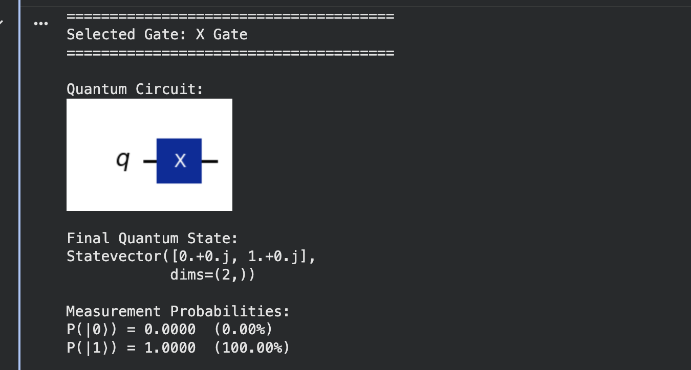
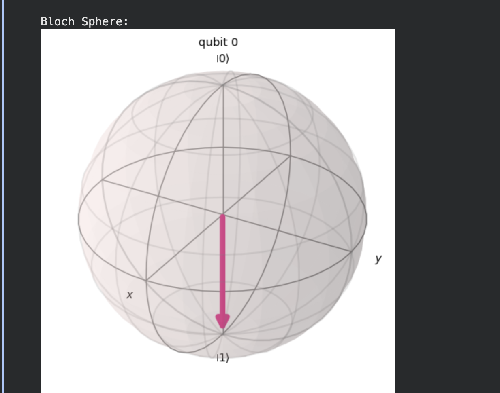
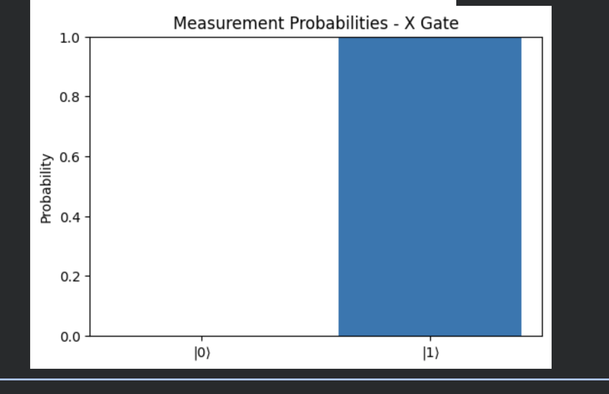


### Y Gate

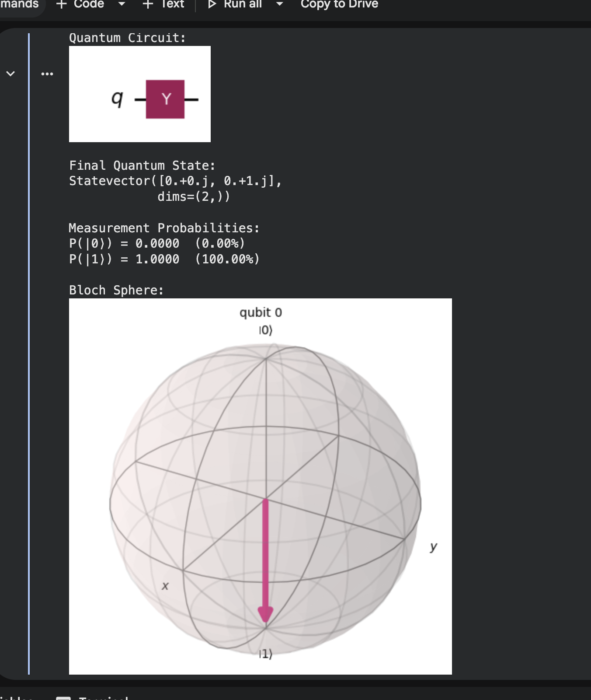
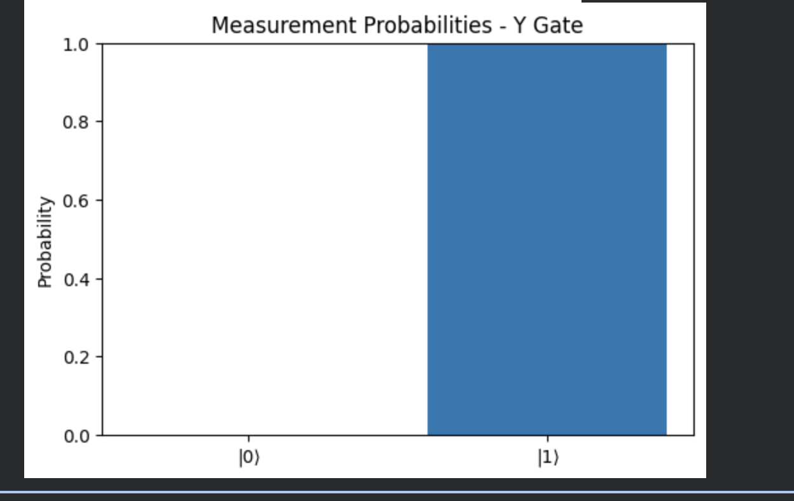

### Z Gate

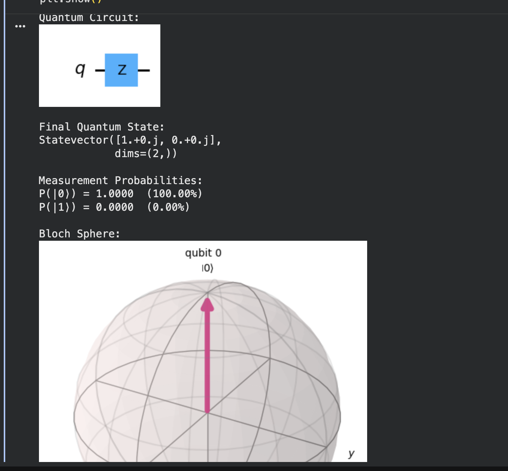
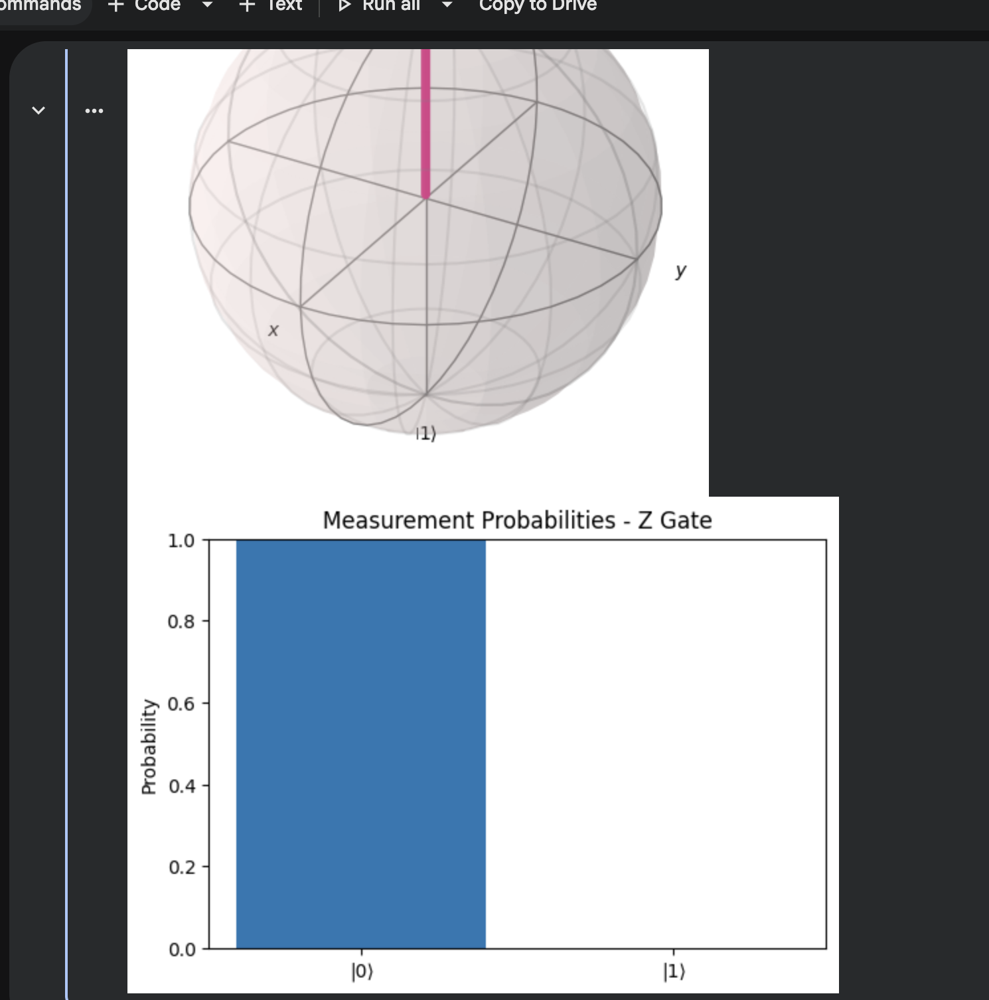

### H Gate

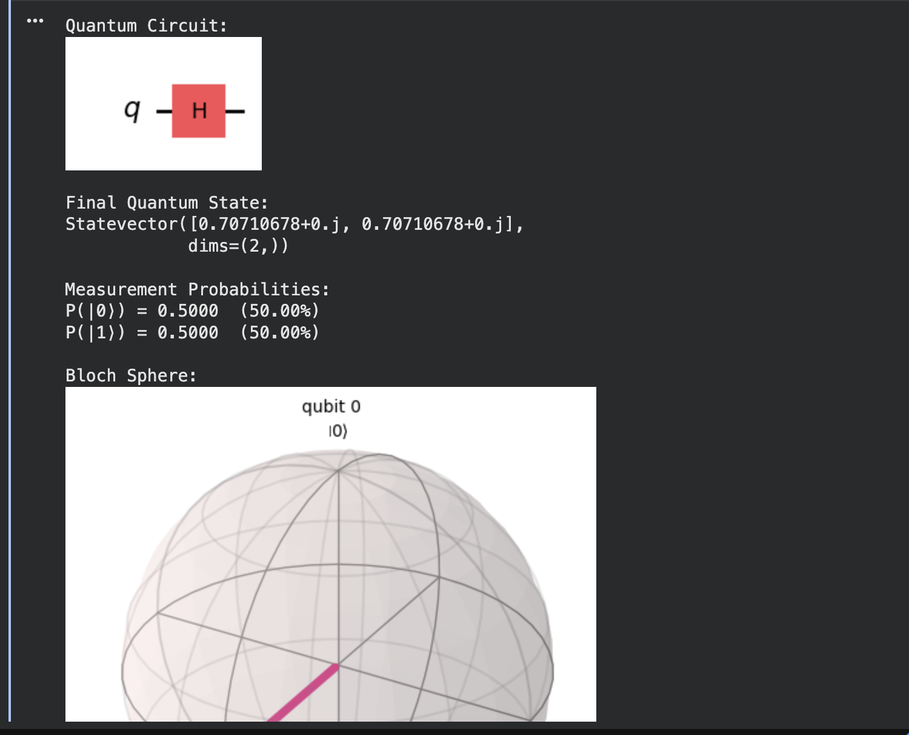
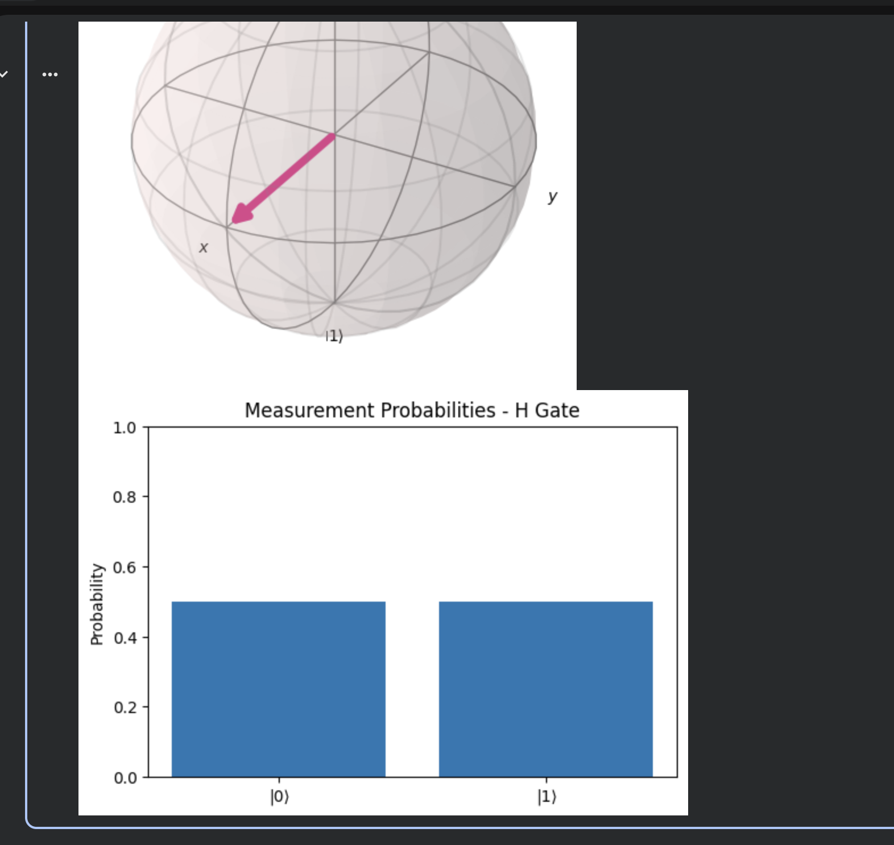

### RY Gate

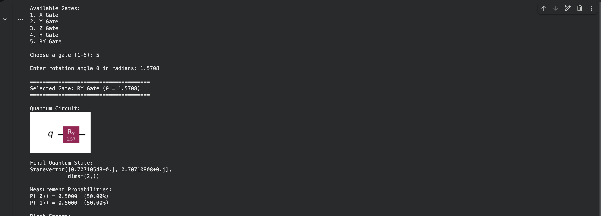
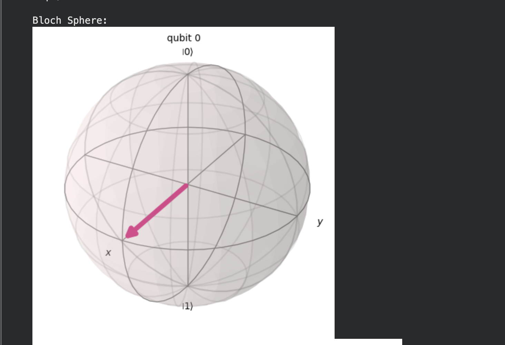
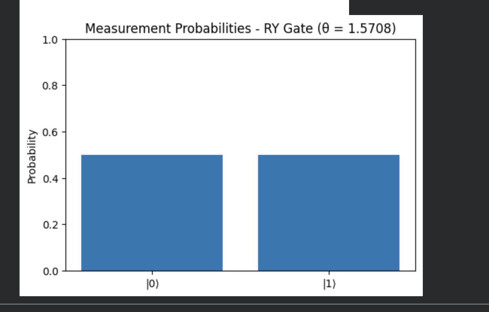


---

## 🛠️ Tech Stack

* Python
* Quantum Computing
* Quantum Circuit Simulation
